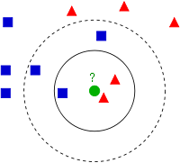

# Bibliotecas utilizadas
```{r message=FALSE, warning=FALSE}
library(mlbench)
library(caret)
```


# Conjunto de dados
```{r}
data(PimaIndiansDiabetes)
diabetes            <-  PimaIndiansDiabetes
head(diabetes)
```


# Divisão entre treino e teste
```{r}
indices     <-  caret::createDataPartition(diabetes$diabetes, p = 0.8, list = T)[[1]]

treinamento <-  diabetes[indices,]
teste       <-  diabetes[-indices,]
```


# Configurações do treinamento
```{r}
controle    <- trainControl(method = "cv", number = 10, returnData = TRUE, 
                            returnResamp = 'all', savePredictions = TRUE, 
                            classProbs = TRUE, summaryFunction = multiClassSummary)
```


# Treinamento

#### Vamos usar o modelo KNN

<center>

**Figura 1** - Modelo KNN

```{r  echo=FALSE, fig.cap="", out.width = '30%'}

```


**Fonte:** https://bityli.com/xuWEJ

</center>


```{r}
set.seed(123)
fit         <- train(diabetes ~., data = treinamento, preProcess = c("center", "scale"), 
                     method = "knn", trControl = controle, metric = "Accuracy", tuneLength= 10)
fit
```


# Teste
```{r}
predclass <- predict(fit, teste, type = "raw")
predprob  <- predict(fit, teste, type = "prob")

confusionMatrix(predclass, teste$diabetes, positive = "pos", mode = 'everything')
```

